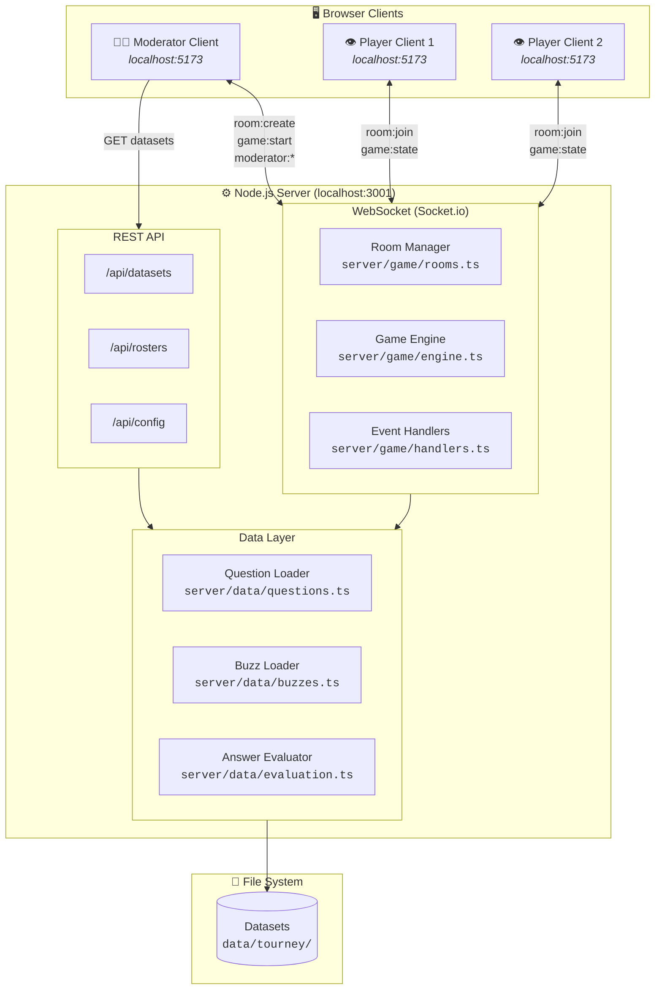
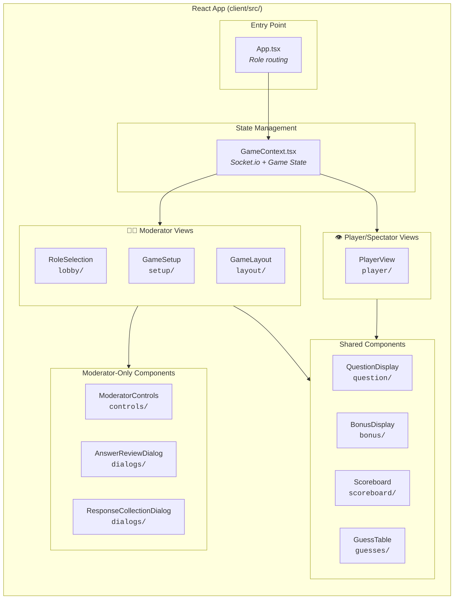
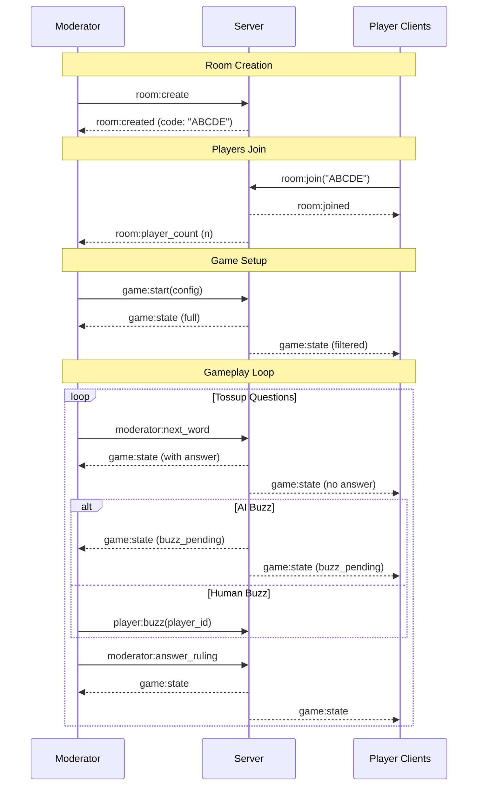

# Quiz Bowl Buzzer - Web Application

A web-based Quiz Bowl buzzer system for human-AI hybrid competitions.

## Features

- **Multi-client architecture**: Moderator controls the game, players/spectators view on separate screens
- **Room-based sessions**: 5-letter join codes for easy access
- **Question navigation sidebar**: Jump to any question with color-coded outcomes (team wins, dead, pending)
- **Question replay**: Replay any question with automatic score adjustment (previous scores reversed)
- Real-time tossup streaming with token-by-token reveal (text + multimodal tokens)
- **Moderator preview mode**: See full question text with grayed unrevealed words
- **Player reveal mode**: Words only appear as they're revealed
- Support for multiple human and AI players per team
- **Mid-game player management**: Add/remove human players during gameplay
- Keyboard-based buzzer system for human players
- AI player responses loaded from pre-generated CSV files
- Configurable scoring (power points, penalties, bonus questions)
- Tournament and simple dataset formats
- Roster management with model validation
- **Tournament bracket system**: Multi-game tournaments with round robin, playoffs, and standings
- **Auto-generated API documentation**: Swagger UI for all REST endpoints

## Client Types

### Moderator Client
- Creates a game room and receives a 5-letter join code
- Full control: start game, reveal tokens, accept/reject answers, navigate/replay questions
- Sees correct answers for all questions
- Sees all dialogs and controls

### Player/Spectator Client  
- Joins a room using the 5-letter code
- View-only: displays game state on a large screen
- Shows: question text, scores, who buzzed, AI guesses
- Does NOT show: correct answers until revealed, answer review dialogs
- Multiple devices can join the same room

---

## Quick Start

```bash
# From the repo root
npm install
npm run dev
```

This starts both:

- The **API server** on `http://localhost:3001`
- The **web client** on `http://localhost:5173`

Open **http://localhost:5173** in your browser.

### Starting a Game Session

1. **Moderator**: Click "Start as Moderator" to create a room
2. **Share the code**: Give the 5-letter room code to players/spectators
3. **Players**: Click "Join as Viewer" and enter the room code
4. **Moderator**: Configure teams, load data, and start the game
5. **Play**: All connected clients see the game in real-time

### Starting a Tournament

1. **Moderator**: Click "Start a Tournament" to open the Tournament Wizard
2. **Wizard**: Select dataset, teams (from human roster), AI assignments, format, and game settings
3. **Create**: Review schedule and create tournament — receive a 6-character tournament code (e.g. `TRN123`)
4. **Dashboard**: View schedule and standings; click "Start Game" on any ready game
5. **Play**: Games run like single-game sessions; use "Back to Tournament Dashboard" when done
6. **Multi-moderator**: Share the tournament code — any moderator can join and run games in parallel

---

## Running Locally (Development)

### Prerequisites

- **Node.js**: **v18.18.0 or higher** (v20+ recommended)
- **npm**: **v9 or higher** (v10+ recommended)

#### Installing Node.js and npm

- **macOS / Linux (recommended)**: Use a version manager like [`nvm`](https://github.com/nvm-sh/nvm) to install and switch Node versions:

  ```bash
  # Install nvm (see nvm README for latest command)
  curl -o- https://raw.githubusercontent.com/nvm-sh/nvm/v0.39.7/install.sh | bash
  # Then in a new shell:
  nvm install 20
  nvm use 20
  ```

- **Windows**: Use the official Node.js installer from [`https://nodejs.org`](https://nodejs.org) (choose an LTS release, 20+), or a version manager like [`nvm-windows`](https://github.com/coreybutler/nvm-windows).

### One-Command Dev Setup

From the repo root:

```bash
npm install
npm run dev
```

This will:

- Start the **backend server** with Express + Socket.io on `http://localhost:3001`
- Start the **frontend dev server** (Vite) on `http://localhost:5173`

You can then:

- Use the UI at `http://localhost:5173` to start games and tournaments.
- Open Swagger UI at `http://localhost:3001/api/docs` to explore and test REST APIs.

### Dev-only single game presets

For rapid iteration on a **single fixed matchup**, you can use dev-only preset entry points that auto-skip the setup wizard.

From the repo root:

```bash
# Uses the data/trails-con dataset
npm run dev:trailscon

# Uses the data/qanta26 dataset
npm run dev:qanta26
```

These will:

- Start the backend on `http://localhost:3001` and the frontend (Vite) on an available port.
- On first load, **auto-create a moderator room** and **auto-start a game** using the matching dataset:
  - Team A: Alice (human) + Charizard (AI)
  - Team B: Bob (human) + Snorlax (AI)
- Bypass the normal Game Setup wizard so you can immediately test gameplay (buzzing, streaming, scoring, logs, etc.).

Notes:

- These presets are **development-only** and are only wired in when `import.meta.env.DEV` is true.
- Each preset expects a tournament-style dataset at `data/<preset>/` (e.g. `data/trails-con/`, `data/qanta26/`) with:
  - `packet_1/tossups.csv`, `packet_1/bonuses.csv`
  - `ai_roster.csv`, `human_roster.csv`
  - `responses/` with the relevant `*.buzz.csv` / `*.bonus.csv` files.
- You can also select a preset at runtime with the `?preset=<id>` query param (e.g. `?preset=qanta26`).
- For regular usage (manual dataset/roster selection and team configuration), continue to use `npm run dev` and the Game Setup wizard.

#### Opening the player/viewer client during a preset run

The preset tab itself is the **moderator** (this is also where humans buzz via the keyboard). Because the preset is set via `VITE_AUTOSTART_PRESET`, every tab opened at the Vite URL would otherwise auto-start its own moderator room. To open the **player/viewer** client instead:

- Copy the room code from the moderator's top bar (e.g. `XU6GM`), then open a new tab at:
  - `http://localhost:5173/?join=XU6GM` — auto-joins that room as a viewer.
- Or open `http://localhost:5173/?preset=none` to land on the normal role-selection screen (then "Join as Viewer" and enter the code).

Both `?join=<code>` and `?preset=none` suppress autostart for that tab, so it won't spawn a competing moderator room.

### Separate Servers (Optional)

If you prefer to run client and server separately:

```bash
# Backend only
npm run dev:server

# Frontend only (expects backend at localhost:3001)
npm run dev:client
```

### Environment Configuration

- `PORT` (default `3001`): Backend HTTP and WebSocket port.
- `VITE_SOCKET_URL`: WebSocket base URL for the client.
  - In local dev this is usually auto-detected; override it when using a remote server.
- Datasets are read from the `data/` directory; see [**Dataset Directory Structure**](##dataset-directory-structure) below for formats.

For more developer-focused information (code structure, where to add features, etc.), see `docs/DEVELOPMENT.md`.

---

## Tournament System

The tournament system orchestrates multiple games between pre-defined teams, tracking standings and bracket progression. Teams come from the human roster (grouped by the `team` column); games use the existing room/engine infrastructure.

### Tournament Formats

| Format | Description | Use Case |
|--------|-------------|----------|
| **Round Robin** | Every team plays every other team once | Fair for small tournaments (4–8 teams) |
| **Round Robin + Single Elimination** | Prelims followed by playoffs | Top N advance to semifinals and final |
| **Single Elimination** | Lose once, you're out | Quick bracket-only tournaments |
| **Grouped Prelims** | Split into groups; round robin within each | Shorter prelim phase (e.g. 2 groups of 4 = 3 rounds each) |

### Tournament Wizard (6 Steps)

1. **Dataset & Packets** — Choose dataset; select packets. Total games must not exceed available packets.
2. **Teams** — Teams auto-grouped from human roster `team` column; enable/disable teams.
3. **AI Assignment** — Optionally add AI players per team. No player on both teams in any game.
4. **Format** — Round Robin only, Round Robin + Single Elim, or Single Elim. Option for grouped prelims.
5. **Game Settings** — Powers, negs, bonus points, and AI score deflation (reused from single-game setup). See [AI Score Deflation](#ai-score-deflation).
6. **Review & Create** — Schedule preview; create tournament; receive 6-char code.

### AI Score Deflation

Both tossup and bonus AI scoring can be deflated based on AI model size (`weight_class`). Each is independently configurable in the rule preset / game settings with three modes:

**Tossup deflation** (`tossup_deflation_mode`) — applied to a correct AI buzz, based on the buzzing AI's weight class:

- `none` — full tossup points, regardless of weight class.
- `static` — subtract a fixed `tossup_static_deflation` (default `5`) from the earned points.
- `weighted` — multiply the earned points by `ai_tossup_score_factors[weight_class]` (default LW 1.0 / MW 0.8 / HW 0.4). This is the QANTA 2026 behavior.

**Bonus consult deflation** (`bonus_deflation_mode`) — applied when a team correctly answers a bonus part via the AI-consult path:

- `none` — full bonus part points.
- `static` — subtract a fixed `bonus_static_deflation` (default `5`).
- `weighted` — subtract the sum of `bonus_weight_deflation[weight_class]` (default LW 1 / MW 2 / HW 3) over **all AI teammates on the owning team**. Example: a team with LW + MW AIs caps a consulted part at `10 - 1 - 2 = 7`.

All awards are clamped to a minimum of `0`. Deflation only affects positive earned points; tossup penalties for wrong buzzes, `own`/`abstain` bonus decisions are unaffected. The legacy `bonus_ai_consult_factor` is retained only as a fallback for configs saved before deflation modes existed.

### Tournament Dashboard

- **Schedule tab**: Games grouped by round and phase (Prelim Round 1, Semifinals, Final). Each game shows teams, packet, status (Scheduled | Ready | In Progress | Completed), and "Start Game" when ready.
- **Standings tab**: W/L, points for/against, sorted by wins then point differential.
- **Round ordering**: Round 2 games are locked until all Round 1 games complete; playoffs unlock after prelims.
- **Multi-moderator**: Any moderator with the code can start ready games; server prevents duplicate starts.

### Tournament Game Flow

1. Moderator clicks "Start Game" on a ready game in the dashboard.
2. Server creates a room, populates teams from the tournament, and emits `room:created` (with `tournamentCode`, `round`, `matchNumber`).
3. Game runs normally; in-game header shows "Round X, Match Y – Team A vs Team B".
4. On game end, standings update automatically; "Back to Tournament Dashboard" returns to schedule.
5. Playoff games (for Round Robin + Single Elim) become ready after prelims; seeds are computed from standings.

### Tournament API Endpoints

| Endpoint | Method | Description |
|----------|--------|--------------|
| `/api/tournaments/list` | GET | List active tournaments |
| `/api/tournaments/:code` | GET | Get tournament details |
| `/api/tournaments` | POST | Create tournament |

### Tournament WebSocket Events

| Event | Direction | Description |
|-------|-----------|-------------|
| `tournament:create` | Client → Server | Create tournament; callback returns `{ code }` |
| `tournament:get` | Client → Server | Get tournament by code; callback returns `{ tournament }` |
| `tournament:start_game` | Client → Server | Start a tournament game; server creates room, emits `room:created` |
| `room:created` | Server → Client | Extended with `tournamentCode`, `round`, `matchNumber` for tournament games |

### Tournament Architecture

- **TournamentManager** (`server/game/tournaments.ts`): In-memory storage; creates tournaments; generates schedules; tracks results.
- **Pluggable schedule generators**: Full round robin, grouped round robin, playoff placeholders. Each produces `TournamentGame[]`; game execution is identical regardless of structure.
- **Game integration**: Rooms created from tournaments have `tournamentGameId`; on game over, handlers call `completeGame` to update standings.

> **📋 Bracket workflow**: For the full bracket creation workflow including user decisions, see [`docs/BRACKET_WORKFLOW.md`](./docs/BRACKET_WORKFLOW.md).
>
> **📋 Implementation details**: For the full implementation plan, action items, and spec alignment, see [`tasks/implementation-plan.md`](./tasks/implementation-plan.md) and [`tasks/action-items.md`](./tasks/action-items.md).

---

## Dataset Directory Structure

The application supports two data formats: **Simple** (single packet) and **Tournament** (multiple packets with rosters).

### Simple Format

For single-packet games or practice sessions:

```
dataset_name/
├── tossups.csv              # Required: Tossup questions
├── bonuses.csv              # Optional: Bonus questions  
└── responses/               # Required for AI players
    ├── model-name.buzz.csv      # Tossup responses
    └── model-name.bonus.csv     # Bonus responses
```

**Example:** `Q25_week1/`

### Tournament Format

For multi-packet tournaments with player rosters:

```
tournament_name/
├── ai_roster.csv            # Required: AI player definitions
├── human_roster.csv         # Required: Human player definitions
├── packet_1/
│   ├── tossups.csv
│   └── bonuses.csv
│   ├── img/                 # Optional: image assets referenced by tossup multimodal tokens
│   └── audio/               # Optional: audio assets referenced by tossup multimodal tokens
├── packet_2/
│   ├── tossups.csv
│   └── bonuses.csv
├── ... (more packets)
└── responses/
    ├── Author__model-name.buzz.csv
    └── Author__model-name.bonus.csv
```

**Example:** `data/tourney/online-0620/`

### File Format Reference

#### tossups.csv

| Column | Required | Description |
|--------|----------|-------------|
| `qid` | Yes | Unique identifier (preferred header) |
| `question` | Yes | Full question text, including optional multimodal markers |
| `clean_answers` | Yes | JSON/array-like acceptable answers |
| `answerline` | Yes | Formatted answer line |
| `has_image` | Yes | Whether tossup contains image multimodal tokens |
| `has_audio` | Yes | Whether tossup contains audio multimodal tokens |
| `category` | No | Question category |

Legacy compatibility during migration:
- `question_id` / `id` accepted for `qid`
- `text` / `question_text` accepted for `question`
- `answers` / `answer` / `answer_refs` accepted for `clean_answers`
- `answerline` remains optional for legacy rows

Multimodal token syntax in `question`:
- `<multimodal type="img" hash="...">`
- `<multimodal type="audio" hash="..." displayText="...">`
- `<multimodal type="delay">`

Multimodal asset resolution:
- Image token hashes resolve to exactly one `packet_X/img/{hash}.{ext}` file.
- Audio token hashes resolve to exactly one `packet_X/audio/{hash}.{ext}` file.
- Missing or ambiguous hash matches are treated as dataset errors.

#### bonuses.csv

| Column | Required | Description |
|--------|----------|-------------|
| `question_id` | Yes | Unique identifier |
| `leadin` | Yes | Bonus lead-in text |
| `part1`, `part2`, `part3` | Yes | Part questions |
| `answer1`, `answer2`, `answer3` | Yes | Part answers |
| `answerline1/2/3` | No | Formatted answer lines |
| `answer_image1/2/3` | No | Packet-relative path (e.g. `img/b6_p1_a.png`) to an image shown on the per-part reveal screen alongside the answer |

#### ai_roster.csv

| Column | Required | Description |
|--------|----------|-------------|
| `player_id` | Yes | Unique player ID |
| `name` | Yes | Display name |
| `type` | Yes | Must be "ai" |
| `tossup_model` | Yes | Model name for tossups (must match response file) |
| `bonus_model` | Yes | Model name for bonuses |
| `tossup_model_cost` | No | Cost metric |
| `skill_level` | No | Skill tier (High, Mid, Low) |
| `weight_class` | No | AI model weight class (`lightweight`, `midweight`, or `heavyweight`), used by the `weighted` tossup/bonus deflation modes. Defaults to `lightweight` when blank. See [AI Score Deflation](#ai-score-deflation). |

**Important:** Model names must exactly match response file names (e.g., `Author__model` → `Author__model.buzz.csv`)

#### human_roster.csv

| Column | Required | Description |
|--------|----------|-------------|
| `player_id` | Yes | Unique player ID |
| `name` | Yes | Display name |
| `type` | Yes | Must be "human" |
| `default_buzzer_key` | No | Default keyboard key for buzzing |
| `team` | No | Team assignment |
| `skill_level` | No | Skill tier |

#### Response Files (*.buzz.csv)

| Column | Required | Description |
|--------|----------|-------------|
| `question_id` | Yes | Matches tossup question_id |
| `token_position` | Yes | Tossup token position (0-indexed) |
| `guess` | Yes | Model's answer guess |
| `confidence` | Yes | Confidence score (0-1) |
| `buzz` | Yes | Whether to buzz (0 or 1) |
| `correct` | No | Whether guess was correct |

#### Response Files (*.bonus.csv)

| Column | Required | Description |
|--------|----------|-------------|
| `question_id` | Yes | Matches bonus question_id |
| `part_number` | Yes | Part number (1, 2, or 3) |
| `guess` | Yes | Model's answer guess |
| `confidence` | Yes | Confidence score (0-1) |
| `correct` | No | Whether guess was correct |

---

## Validation

The application validates datasets and shows warnings/errors:

| Issue | Type | Description |
|-------|------|-------------|
| Missing tossup responses | Error | AI roster references model without .buzz.csv file |
| Missing bonus responses | Warning | AI roster references model without .bonus.csv file |
| No responses directory | Warning | No AI players can be used |
| No AI roster | Warning | Dataset has models but no roster to define AI players |

---

## Keyboard Controls

| Key | Action |
|-----|--------|
| `1-9` (or custom) | Buzz for human player |
| `A`,`S`,`D`,… (auto-assigned) | Buzz on behalf of a semi-autonomous AI |
| `→` or `Space` | Reveal next token / advance bonus lead-in |
| `=` or `+` | Accept answer (in review dialog) |
| `-` | Reject answer (with penalty if configured, otherwise no penalty) |

> Semi-autonomous AI keys are auto-assigned from a separate letter pool so they never collide with the human `1-9` buzzer keys. The assigned key is shown next to the AI in the scoreboard when it is in **Semi** mode.

---

## API Documentation

### Interactive API Docs (Swagger UI)

After starting the server, visit:

- **Swagger UI**: [http://localhost:3001/api/docs](http://localhost:3001/api/docs)
- **OpenAPI JSON**: [http://localhost:3001/api/docs.json](http://localhost:3001/api/docs.json)

The Swagger UI provides interactive documentation where you can explore and test all API endpoints.

---

## API Endpoints

### Configuration
- `GET /api/config/defaults` - Default game configuration
- `POST /api/config/update` - Update configuration
- `GET /api/config/presets` - List selectable rule presets (e.g. Default, QANTA 2026)
- `GET /api/config/presets/:id` - Get a rule preset's config overrides

### Datasets
- `GET /api/datasets/list` - List all available datasets with validation
- `GET /api/datasets/:id` - Get dataset details
- `GET /api/datasets/:id/validate` - Validate dataset
- `GET /api/datasets/help/structure` - Get structure documentation (JSON)

### Rosters
- `GET /api/rosters/list` - List all roster files
- `GET /api/rosters/ai?dataset=ID` - Get AI players (optionally from dataset)
- `GET /api/rosters/human?dataset=ID` - Get human players

### Tournaments
- `GET /api/tournaments/list` - List active tournaments
- `GET /api/tournaments/:code` - Get tournament details (schedule, standings)
- `POST /api/tournaments` - Create tournament (body: name, format, datasetId, teams, packets, etc.)

### Files
- `POST /api/files/upload` - Upload question/response files
- `GET /api/files/list` - List uploaded files
- `DELETE /api/files/:filename` - Delete uploaded file

### Health
- `GET /api/health` - Server health check

---

## WebSocket Events

### Room Events
- `room:create` → `room:created` - Moderator creates a room (returns 5-letter code)
- `room:join` → `room:joined` - Player joins a room with code
- `room:leave` - Leave current room
- `room:player_count` - Moderator receives player count updates
- `room:error` - Room-related errors

### Tournament Events
- `tournament:create` - Create tournament; callback returns `{ code }`
- `tournament:get` - Get tournament by code; callback returns `{ tournament }`
- `tournament:start_game` - Start a tournament game; server creates room, emits `room:created` (with `tournamentCode`, `round`, `matchNumber`)

### Game Events (Client → Server)
- `game:start` - Start a new game with config (moderator only)
- `moderator:next_word` - Reveal next tossup token (moderator only)
- `player:buzz` - Player buzzes in (moderator triggers for human players)
- `moderator:answer_ruling` - Accept/reject answer (moderator only)
- `moderator:adjust_points` - Manual score adjustment (moderator only)
- `moderator:play_tossup` - Jump to and play specific tossup (moderator only)
- `moderator:play_bonus` - Jump to and play specific bonus (moderator only)
- `moderator:add_player` - Add human player mid-game (moderator only)
- `moderator:remove_player` - Remove human player mid-game (moderator only)
- `moderator:can_modify_players` - Check if players can be modified (moderator only)
- `moderator:set_ai_buzz_mode` - Set an AI's tossup buzz mode: `autonomous` / `muted` / `semi` (moderator only)
- `moderator:set_autonomous_k` - Update a single AI's "autonomous after k tokens" threshold live during a game; `k=1` means no gate (moderator only)
- `moderator:ai_buzz` - Buzz on behalf of a semi-autonomous AI (moderator only)
- `bonus:advance` - Advance the bonus lead-in to the first part (moderator only)
- `bonus:reveal_ai` - Reveal AI responses for the current bonus part / consult path (moderator only)
- `bonus:part_result` - Resolve a bonus part with a decision (`own` / `consult_ai` / `abstain`) and correctness (moderator only). Moves to the per-part reveal screen
- `bonus:next_part` - Advance from the per-part reveal screen (answer line, answer image, AI responses) to the next part or tossup (moderator only)

> The legacy `player:mute_toggle`, `bonus:human_response`, and `bonus:final_answer` events are superseded by the events above under the QANTA 2026 rules.

### Game Events (Server → Client)
- `game:state` - Full game state update (filtered for players)
- `game:config` - Game configuration
- `game:error` - Error message

---

## Development

```bash
# Development mode (hot reload, client + server)
npm run dev

# Build for production (client + server)
npm run build

# Production server (after build)
npm start

# Linting
npm run lint

# Type checking (client + server)
npm run typecheck

# Tests (Vitest)
npm test
```

---

## Testing

### Unit / Integration Tests

- **Command**: `npm test`
- **Runner**: Vitest (configured in `package.json`)
- **Location**: Current tests live primarily under `server/game/` (for example, `tournaments.test.ts`).

You can also run Vitest in watch mode:

```bash
npx vitest --watch
```

### Dataset Validation as Tests

Dataset validation endpoints act as a practical test suite for your data:

- `GET /api/datasets/:id/validate` – Validate a specific dataset.
- `GET /api/datasets/help/structure` – Return the expected structure as JSON.

To use these:

1. Run the app locally (`npm run dev`).
2. Open Swagger UI at `http://localhost:3001/api/docs`.
3. Call the dataset endpoints above to confirm that your files and rosters are valid.

Validation issues are also surfaced in the UI (see **Validation** below) and server logs.

---

## Production Deployment

### Docker

```bash
docker-compose up --build
```

### Environment Variables

| Variable | Default | Description |
|----------|---------|-------------|
| `PORT` | 3001 | Server port |
| `VITE_SOCKET_URL` | - | WebSocket URL (auto-detected in dev) |

---

## System Architecture

### High-Level Overview



### Client Architecture



### Game Flow & Room Management



### UI Views by Client Role

| Component | Moderator | Player/Spectator | Code Location |
|-----------|:---------:|:----------------:|---------------|
| **Role Selection** | ✅ Creates room / Start Tournament | ✅ Joins room / Join Tournament | `client/src/components/lobby/RoleSelection.tsx` |
| **Tournament Wizard** | ✅ Create tournament | ❌ | `client/src/components/tournament/TournamentWizard.tsx` |
| **Tournament Dashboard** | ✅ Schedule, standings, start games | ❌ | `client/src/components/tournament/TournamentDashboard.tsx` |
| **Game Setup Wizard** | ✅ Full access | ❌ | `client/src/components/setup/GameSetup.tsx` |
| **File/Dataset Loader** | ✅ | ❌ | `client/src/components/setup/FileUploader.tsx` |
| **Team Builder** | ✅ | ❌ | `client/src/components/setup/TeamBuilder.tsx` |
| **Scoreboard** | ✅ Detailed | ✅ Compact | `client/src/components/scoreboard/` |
| **Question Display** | ✅ + Answer | ✅ No answer | `client/src/components/question/QuestionDisplay.tsx` |
| **Bonus Display** | ✅ + Answer | ✅ No answer | `client/src/components/bonus/BonusDisplay.tsx` |
| **AI Guess Table** | ✅ Full (guess + conf) | ✅ Confidence only | `client/src/components/guesses/GuessTable.tsx` |
| **Top Guess Display** | ✅ | ❌ | `client/src/components/layout/GameLayout.tsx` |
| **Moderator Controls** | ✅ | ❌ | `client/src/components/controls/ModeratorControls.tsx` |
| **Answer Review Dialog** | ✅ | ❌ | `client/src/components/dialogs/AnswerReviewDialog.tsx` |
| **Response Collection** | ✅ | ❌ | `client/src/components/dialogs/ResponseCollectionDialog.tsx` |
| **Player View** | ❌ | ✅ | `client/src/components/player/PlayerView.tsx` |
| **Question Navigation** | ✅ | ❌ | `client/src/components/navigation/QuestionNavSidebar.tsx` |

### Directory Structure

```
buzzer-web/
├── client/                     # React frontend (Vite + TypeScript)
│   ├── src/
│   │   ├── components/
│   │   │   ├── bonus/          # Bonus question display
│   │   │   ├── controls/       # Moderator control buttons
│   │   │   ├── dialogs/        # Modal dialogs (answer review, etc.)
│   │   │   ├── guesses/        # AI guess table
│   │   │   ├── layout/         # Main game layout (moderator)
│   │   │   ├── lobby/          # Role selection screen
│   │   │   ├── navigation/     # Question navigation sidebar
│   │   │   ├── player/         # Player/spectator view
│   │   │   ├── tournament/     # Tournament wizard & dashboard
│   │   │   ├── question/       # Tossup question display
│   │   │   ├── scoreboard/     # Team panels and scores
│   │   │   └── setup/          # Game setup wizard
│   │   ├── api/                # Lightweight client API types (datasets, rosters)
│   │   ├── context/
│   │   │   └── GameContext.tsx # Global state + Socket.io
│   │   ├── dev/                # Dev-only helpers (e.g., Trails-Con autostart preset)
│   │   ├── hooks/
│   │   │   └── useKeyboardBuzzer.ts # Keyboard event handling
│   │   ├── utils/
│   │   │   └── buildGameConfig.ts   # Shared helper for building GameConfig objects
│   │   ├── styles/
│   │   │   └── globals.css     # Tailwind CSS
│   │   ├── App.tsx             # Main app with role routing
│   │   └── socket.ts           # Socket.io client setup
│   └── index.html
│
├── server/                     # Node.js backend (Express + Socket.io)
│   ├── data/
│   │   ├── questions.ts        # Load tossups & bonuses from CSV
│   │   ├── buzzes.ts           # Load AI responses from CSV
│   │   └── evaluation.ts       # Answer matching logic
│   ├── game/
│   │   ├── engine.ts           # Game state machine
│   │   ├── handlers.ts         # Socket.io event handlers
│   │   ├── rooms.ts            # Room management (join codes)
│   │   ├── tournaments.ts      # Tournament manager (schedules, standings)
│   │   └── tournament-handlers.ts  # Tournament socket handlers
│   ├── routes/
│   │   ├── config.ts           # Game config API
│   │   ├── datasets.ts         # Dataset listing & validation
│   │   ├── files.ts            # File upload handling
│   │   ├── rosters.ts          # Player roster API
│   │   └── tournaments.ts      # Tournament REST API
│   ├── swagger.ts              # Swagger/OpenAPI documentation config
│   └── index.ts                # Server entry (Express + Socket.io)
│
├── shared/
│   └── types.ts                # TypeScript types (shared)
│
└── data/tourney/               # Dataset storage location
```

---

## Code Structure & Development Guide

This section helps developers understand where different functionality lives and where to make changes.

### Frontend (React) - `client/src/`

#### Entry Points
- **`App.tsx`**: Main application component that routes between moderator and player views based on role
- **`main.tsx`**: React app entry point
- **`socket.ts`**: Socket.io client initialization and connection management

#### State Management
- **`context/GameContext.tsx`**: 
  - Global game state provider using React Context
  - Manages Socket.io connection and event listeners
  - Provides game state, config, and helper functions to all components
  - **Key functions**: `startGame()`, `buzz()`, `nextWord()`, `submitAnswerRuling()`, etc.
  - **When to modify**: Adding new Socket.io events, changing state structure, adding helper functions

#### UI Components by Category

**Lobby & Setup** (`components/lobby/`, `components/setup/`, `components/tournament/`)
- **`lobby/RoleSelection.tsx`**: Initial screen for choosing moderator, player, or tournament (Start a Tournament, Join Tournament)
- **`setup/GameSetup.tsx`**: Multi-step wizard for configuring game (datasets, teams, players)
- **`setup/FileUploader.tsx`**: File upload interface for questions/responses
- **`setup/TeamBuilder.tsx`**: Team configuration with player selection (AI/human)
  - **When to modify**: Changing setup flow, adding new configuration options
- **`tournament/TournamentWizard.tsx`**: 6-step wizard for creating tournaments (dataset, teams, AI, format, settings, review)
- **`tournament/TournamentDashboard.tsx`**: Schedule and standings; start games; "Back to Tournament" from game over
  - **When to modify**: Changing tournament flow, adding new bracket formats

**Game Display** (`components/layout/`, `components/question/`, `components/bonus/`)
- **`layout/GameLayout.tsx`**: Main moderator game view layout
  - Contains question display, scoreboard, AI guesses, controls
  - **When to modify**: Changing moderator view layout, adding new sections
- **`question/QuestionDisplay.tsx`**: Tossup question display for moderator
  - Shows full question with grayed unrevealed words
  - **When to modify**: Changing question display format, word reveal behavior
- **`bonus/BonusDisplay.tsx`**: Bonus question display for moderator
  - Shows lead-in and parts with answers
  - **When to modify**: Changing bonus display format

**Player View** (`components/player/`)
- **`player/PlayerView.tsx`**: Read-only spectator/player view
  - Two-row layout: teams at top, question below
  - Shows confidences (not guesses) for tossups
  - Shows full AI outputs for bonuses
  - **When to modify**: Changing player view layout, information display

**Navigation** (`components/navigation/`)
- **`navigation/QuestionNavSidebar.tsx`**: Vertical sidebar with question navigation
  - Two-column layout (tossups | bonuses)
  - Color-coded by outcome (team colors, dead, pending)
  - Preview dialog with "Play" button to jump to questions
  - **When to modify**: Changing navigation UI, adding question metadata display

**Scoreboard** (`components/scoreboard/`)
- **`scoreboard/Scoreboard.tsx`**: Main scoreboard container
- **`scoreboard/TeamPanel.tsx`**: Individual team panel with players, scores, mute status
  - Includes "Manage Players" button for mid-game player management
  - **When to modify**: Changing scoreboard layout, team display

**Controls** (`components/controls/`)
- **`controls/ModeratorControls.tsx`**: Control buttons for moderator actions
  - Adjust points, mute players, etc.
  - **When to modify**: Adding new moderator actions

**Dialogs** (`components/dialogs/`)
- **`dialogs/AnswerReviewDialog.tsx`**: Dialog for accepting/rejecting answers
  - Shows player guess, correct answer (for AI), keyboard shortcuts
  - **When to modify**: Changing answer review UI, adding new ruling types
- **`dialogs/ResponseCollectionDialog.tsx`**: Dialog for collecting human bonus responses
- **`dialogs/PlayerManagementDialog.tsx`**: Dialog for adding/removing players mid-game
- **`dialogs/AdjustPointsDialog.tsx`**: Dialog for manual score adjustments
  - **When to modify**: Changing dialog behavior, adding new dialogs

**AI Outputs** (`components/guesses/`)
- **`guesses/GuessTable.tsx`**: Table showing all AI guesses with confidences
  - **When to modify**: Changing guess display format, adding columns

**Hooks** (`hooks/`)
- **`hooks/useKeyboardBuzzer.ts`**: Keyboard event handling for human player buzzes
  - **When to modify**: Changing buzzer key mappings, adding keyboard shortcuts

### Backend (Node.js) - `server/`

#### Server Entry
- **`index.ts`**: 
  - Express server setup
  - Socket.io server initialization
  - API route registration
  - CORS configuration
  - **When to modify**: Adding new API routes, changing server configuration

#### Game Logic (`server/game/`)

**`game/engine.ts`** - Core Game Engine
- **`GameEngine` class**: Main game state machine
  - Manages game phases: `setup`, `tossup_ready`, `tossup_streaming`, `answer_review`, `bonus_*`, `game_over`
  - Handles question progression, scoring, answer evaluation
  - Tracks question results for navigation sidebar
  - **Key methods**:
    - `initialize()`: Load questions and AI responses
    - `startGame()`: Begin a new game
    - `nextQuestion()`: Move to next tossup
    - `revealNextWord()`: Stream words one by one
    - `handleBuzz()`: Process player buzz
    - `handleAnswerRuling()`: Process accept/reject decision
    - `startBonusQuestion()`: Begin bonus question
    - `handleBonusFinalAnswer()`: Process bonus answer
    - `playTossup(index)`: Jump to specific tossup
    - `playBonus(index, owner)`: Jump to specific bonus
    - `addPlayer()` / `removePlayer()`: Mid-game player management
  - **When to modify**: Changing game rules, scoring logic, phase transitions, question navigation

**`game/handlers.ts`** - Socket.io Event Handlers
- Handles all WebSocket events from clients
- Routes events to `GameEngine` methods
- Manages room state broadcasting (moderator vs player filtering)
- **Key handlers**:
  - `room:create`, `room:join`: Room management
  - `game:start`: Initialize game
  - `moderator:next_word`: Tossup token revelation
  - `player:buzz`: Player buzzes
  - `moderator:answer_ruling`: Answer acceptance/rejection
  - `moderator:play_tossup`, `moderator:play_bonus`: Question navigation
  - `moderator:add_player`, `moderator:remove_player`: Player management
- **When to modify**: Adding new Socket.io events, changing event routing

**`game/rooms.ts`** - Room Management
- **`RoomManager` class**: Manages game rooms and client connections
  - Creates rooms with 5-letter codes
  - Tracks moderator and player connections
  - Caches game state and config per room
  - **When to modify**: Changing room creation logic, join code generation

**`game/tournaments.ts`** - Tournament Manager
- **`TournamentManager` class**: Manages tournament lifecycle
  - Creates tournaments with 6-character codes
  - Generates schedules (full round robin, grouped prelims, playoff placeholders)
  - Tracks game results and standings
  - `startGame()`: Creates room from tournament game, populates teams
  - `completeGame()`: Updates game status and standings on game over
  - **When to modify**: Adding new bracket formats, changing schedule generation

**`game/tournament-handlers.ts`** - Tournament Socket Handlers
- Handles `tournament:create`, `tournament:get`, `tournament:start_game`
- Integrates with room creation and game engine
  - **When to modify**: Adding new tournament events

#### Data Layer (`server/data/`)

**`data/questions.ts`** - Question Loading
- **`Questions` class**: Loads and manages tossup/bonus questions
  - Supports CSV, JSON, JSONL formats
  - Handles power marks and answer equivalents
  - **When to modify**: Changing question file format, adding new question types

**`data/buzzes.ts`** - AI Response Loading
- **`Buzzes` class**: Loads AI model responses from CSV files
  - Maps model names to response files
  - Provides responses for specific questions
  - **When to modify**: Changing response file format, adding new response types

**`data/evaluation.ts`** - Answer Evaluation
- **`evaluateAnswer()`**: Checks if a guess matches correct answers
  - Handles inflection (singular/plural)
  - Uses answer equivalents
  - **When to modify**: Changing answer matching logic, adding new evaluation rules

#### API Routes (`server/routes/`)

**`routes/datasets.ts`**: Dataset listing and validation
- Lists available datasets
- Validates dataset structure
- Returns dataset metadata
- **When to modify**: Changing dataset validation rules, adding new dataset formats

**`routes/rosters.ts`**: Player roster management
- Lists AI and human rosters
- Loads rosters from CSV files
- **When to modify**: Changing roster format, adding new roster fields

**`routes/tournaments.ts`**: Tournament REST API
- List, get, and create tournaments
- **When to modify**: Adding new tournament endpoints

**`routes/config.ts`**: Game configuration API
- Default game settings
- Configuration updates
- **When to modify**: Adding new configuration options

**`routes/files.ts`**: File upload handling
- Handles multipart file uploads
- Lists and deletes uploaded files
- **When to modify**: Changing upload behavior, adding file validation

**`swagger.ts`**: API documentation
- Swagger/OpenAPI configuration
- Auto-generates API docs from JSDoc comments
- **When to modify**: Updating API documentation format

### Shared Types (`shared/types.ts`)

- **TypeScript interfaces and types** shared between frontend and backend
- **Key types**:
  - `GameState`: Complete game state structure
  - `GameConfig`: Game configuration
  - `Player`, `Team`: Player and team definitions
  - `TossupQuestion`, `BonusQuestion`: Question structures
  - `TossupResponse`, `BonusResponse`: AI response structures
  - `QuestionResult`: Question outcome tracking for navigation (includes `previousScore` for replay)
  - `Tournament`, `TournamentGame`, `TournamentTeam`, `TeamStanding`: Tournament structures
  - `ClientToServerEvents`, `ServerToClientEvents`: Socket.io event types
- **When to modify**: Adding new state fields, changing data structures, adding new events

### Game State Management

#### State Initialization
- **`createInitialGameState()`**: Creates a fresh game state with all fields properly initialized
- All nullable fields (`currentTossupId`, `currentBonusId`, `bonusOwner`, etc.) are set to `null`
- All arrays are initialized as empty arrays
- All numeric fields have sensible defaults

#### State Cleanup Patterns
The engine properly cleans up state when transitioning between phases:

- **Starting a new game** (`startGame()`): Resets all game state including scores, question numbers, and muted players
- **Starting a tossup** (`startTossupQuestion()`): 
  - Resets tossup-specific fields (token index, revealed text, lockout/multimodal state, team buzzed, etc.)
  - **Clears bonus-related state** to prevent stale data
- **Starting a bonus** (`startBonusQuestion()`):
  - Resets bonus-specific fields (part number, stage, responses, etc.)
  - **Clears tossup-related state** (buzzing player, guesses, answers) to prevent stale data

#### State Filtering for Players
- **`filterStateForPlayer()`**: Removes moderator-only information before sending to player clients
- **Filtered fields**:
  - `currentTossupAnswer` → `null` (players don't see answers until revealed)
  - `currentBonusPartAnswer` → `null`
  - `fullTossupText` → `null` (players only see `revealedText`)
  - `fullTossupTokens` → `null` (players do not receive unrevealed tossup token stream)
  - `tossupResults` → `[]` (navigation sidebar data)
  - `bonusResults` → `[]`
- **Security**: Full question preview tokens are never sent to player clients, only revealed text + active multimodal event

#### State Consistency Notes
- **Question numbering**: `currentTossupNum` and `currentBonusNum` are 1-indexed for display but used as 0-indexed for array access
- **Score tracking**: When replaying questions, previous scores are automatically reversed before replay
- **Phase transitions**: All phase transitions properly reset relevant state fields
- **Null safety**: Components check for null before accessing nullable fields (`bonusQuestion`, `bonusOwner`, etc.)

#### Important State Fields

**Always Present:**
- `phase`, `scores`, `mutedPlayers`, `totalTossups`, `totalBonuses`

**Tossup Phase Only:**
- `currentTossupId`, `currentTossupAnswer`, `fullTossupText`, `wordIndex`, `revealedText`, `teamBuzzed`, `buzzingPlayer`, `currentGuesses`, `tossupPointsValue`

**Bonus Phase Only:**
- `currentBonusId`, `bonusOwner`, `bonusQuestion`, `currentBonusPart`, `bonusStage`, `bonusResponses`, `currentBonusPartAnswer`

**Moderator Only (filtered for players):**
- `currentTossupAnswer`, `currentBonusPartAnswer`, `fullTossupText`, `tossupResults`, `bonusResults`

> **📋 State Review**: For a detailed analysis of state consistency, cleanup patterns, and best practices, see [`STATE_REVIEW.md`](./STATE_REVIEW.md).

### Common Modification Tasks

#### Adding a New UI Component
1. Create component in appropriate `client/src/components/` subdirectory
2. Import and use in parent component (e.g., `GameLayout.tsx` or `PlayerView.tsx`)
3. Add any needed state to `GameContext.tsx` if global state is required
4. Add Socket.io events in `shared/types.ts` if server communication needed

#### Adding a New Game Feature
1. **Frontend**: Add UI component and Socket.io event emission in `GameContext.tsx`
2. **Backend**: Add event handler in `server/game/handlers.ts`
3. **Logic**: Implement feature in `server/game/engine.ts` (if game logic)
4. **Types**: Update `shared/types.ts` with new event types and state fields
5. **State**: Update `GameState` interface if new state is needed
6. **State Cleanup**: Ensure new state fields are properly reset in `startGame()`, `startTossupQuestion()`, or `startBonusQuestion()` as appropriate
7. **State Filtering**: If the new field contains moderator-only info, add it to `filterStateForPlayer()` to set it to `null` or empty for players

#### Changing Game Rules
1. Modify `server/game/engine.ts` methods (scoring, phase transitions, etc.)
2. Update `shared/types.ts` if rule changes affect state structure
3. Update UI components if rule changes affect display

#### Adding a New API Endpoint
1. Create route handler in `server/routes/[name].ts`
2. Register route in `server/index.ts`
3. Add JSDoc comments for Swagger documentation
4. Add types in `shared/types.ts` if needed

#### Adding a New Tournament Bracket Format
1. Add generator in `server/game/tournaments.ts` (e.g. `generateSwissGames()`)
2. Add format option to `TournamentFormat` in `shared/types.ts`
3. Add wizard step/option in `TournamentWizard.tsx` for the new format
4. Update `CreateTournamentParams` and `createTournament()` to handle the new format

#### Changing Question Display Format
- **Moderator view**: `client/src/components/question/QuestionDisplay.tsx` or `bonus/BonusDisplay.tsx`
- **Player view**: `client/src/components/player/PlayerView.tsx`
- **Both**: Update shared components or create new ones

#### Adding Keyboard Shortcuts
1. Add handler in `client/src/hooks/useKeyboardBuzzer.ts` (for buzzes)
2. Or add `useEffect` with keyboard listener in component (for other shortcuts)
3. Document in README Keyboard Controls section

#### Modifying Answer Evaluation
1. Update `server/data/evaluation.ts` logic
2. Test with various answer formats
3. Update answer equivalent files if needed

---

## Troubleshooting

### "Missing tossup responses for player X"
- Check that the `tossup_model` in `ai_roster.csv` matches a `.buzz.csv` file in `responses/`
- Model name must be exact (case-sensitive)

### "No datasets found"
- Place datasets in `data/tourney/` directory
- Ensure dataset has `tossups.csv` or `packet_*/tossups.csv`

### WebSocket connection fails
- Check server is running on port 3001
- Check browser console for CORS errors
- Verify `VITE_SOCKET_URL` if deploying to different domain

### Tournament creation fails ("Total games exceeds packets")
- Ensure number of scheduled games ≤ number of selected packets
- Round robin: n teams → n(n−1)/2 games (e.g. 5 teams = 10 games)
- Round robin + playoffs: prelim games + 3 (2 semifinals + 1 final)

### Tournament game won't start
- Round 2+ games require all previous round games to be completed
- Playoff games require all prelim games completed and seeds computed
