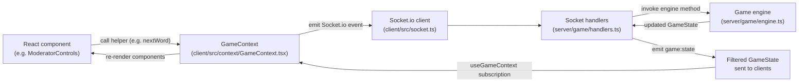

# Development Guide

This document is for contributors who want to **run the app in development**, understand the **code layout**, and know **where to implement new features**.

- For a high-level product overview and quickstart, see `README.md`.
- For tournament-specific behavior, see `docs/BRACKET_WORKFLOW.md`.
- For deep game-state details, see `STATE_REVIEW.md`.

---

## Code Structure Overview

- **Frontend**: React + Vite in `client/src/`
  - UI components by feature area (lobby, setup, tournament, game layout, dialogs, etc.)
  - Global game state and Socket.io integration in `context/GameContext.tsx`
- **Backend**: Express + Socket.io in `server/`
  - Game engine and room/tournament managers in `server/game/`
  - REST APIs in `server/routes/`
  - CSV loading and answer evaluation in `server/data/`
- **Shared Types**: Cross-cutting TypeScript types in `shared/types.ts`
- **Datasets**: Tournament and simple formats under `data/`

The directory tree in `README.md` gives a concise snapshot of these folders.

---

## Frontend (React) – `client/src/`

### Entry Points

- **`main.tsx`**: React root; wraps `App` in providers (including `GameContext`).
- **`App.tsx`**: Main application component that routes between moderator and player/tournament views based on role.
- **`socket.ts`**: Socket.io client initialization and connection management (single shared client).

### State Management

- **`context/GameContext.tsx`**
  - Global game state provider implemented with React Context.
  - Manages the Socket.io connection and event listeners.
  - Exposes helpers used by UI components:
    - `startGame()`, `buzz()`, `nextWord()`, `submitAnswerRuling()`, `startTournamentGame()`, etc.
  - **Modify here when**:
    - Adding new Socket.io events.
    - Changing the shape of `GameState`/`GameConfig`.
    - Adding convenience methods used across multiple screens.

### UI Components by Area

- **Lobby & Setup** (`components/lobby/`, `components/setup/`, `components/tournament/`)
  - `lobby/RoleSelection.tsx`: Initial screen for choosing moderator, player, or tournament (Start / Join Tournament).
  - `setup/GameSetup.tsx`: Multi-step wizard for configuring a single game (datasets, teams, players).
  - `setup/FileUploader.tsx`: File upload UI for questions/responses.
  - `setup/TeamBuilder.tsx`: Team configuration with human/AI player selection.
  - `tournament/TournamentWizard.tsx`: 6-step tournament creation wizard.
  - `tournament/TournamentDashboard.tsx`: Tournament schedule, standings, and “Start Game” controls.

- **Game Display** (`components/layout/`, `components/question/`, `components/bonus/`)
  - `layout/GameLayout.tsx`: Main moderator game view layout (question, scoreboard, AI guesses, controls).
  - `question/QuestionDisplay.tsx`: Tossup display for moderator, including gray unrevealed words.
  - `bonus/BonusDisplay.tsx`: Bonus display (lead-in + three parts and answers).

- **Player View** (`components/player/`)
  - `player/PlayerView.tsx`: Read-only player/spectator view.
    - Compact scoreboard row + question region.
    - Tossups show confidences (not full AI guesses); bonuses show full outputs.

- **Navigation** (`components/navigation/`)
  - `navigation/QuestionNavSidebar.tsx`: Two-column question navigation (tossups | bonuses) with color-coded outcomes and preview/jump controls.

- **Scoreboard** (`components/scoreboard/`)
  - `scoreboard/Scoreboard.tsx`: Main scoreboard container.
  - `scoreboard/TeamPanel.tsx`: Panel per team with players, scores, mute status, and “Manage Players.”

- **Controls & Dialogs**
  - `controls/ModeratorControls.tsx`: Buttons and shortcuts for moderator actions.
  - `dialogs/AnswerReviewDialog.tsx`: Accept/reject dialog with keyboard shortcuts.
  - `dialogs/ResponseCollectionDialog.tsx`: Collect human bonus responses.
  - `dialogs/PlayerManagementDialog.tsx`: Add/remove players mid-game.
  - `dialogs/AdjustPointsDialog.tsx`: Manual score adjustments.

- **AI Outputs** (`components/guesses/`)
  - `guesses/GuessTable.tsx`: Tabular view of AI guesses + confidences.

- **Hooks** (`hooks/`)
  - `hooks/useKeyboardBuzzer.ts`: Central place for keyboard event handling for human buzzers and shortcuts.

---

## Backend (Node.js) – `server/`

### Server Entry

- **`server/index.ts`**
  - Creates the Express HTTP server.
  - Hooks up Socket.io.
  - Registers REST routes from `server/routes/`.
  - Configures CORS and static assets as needed.
  - **Modify here when** you add a new REST route file or global middleware.

### Game Logic (`server/game/`)

- **`game/engine.ts`** – Core Game Engine
  - `GameEngine` class is the main game state machine.
  - Handles phases such as `setup`, `tossup_ready`, `tossup_streaming`, `answer_review`, `bonus_*`, `game_over`.
  - Encodes rules for:
    - Tossup progression and buzz windows.
    - Scoring (powers, negs, bonuses).
    - Bonus part advancement and final answers.
    - Question replay and result tracking.
  - **Modify here when** you change game rules, scoring, or add new phases.

- **`game/handlers.ts`** – Socket.io Event Handlers
  - Translates incoming events into engine calls and emits filtered state back to clients.
  - Important events:
    - `room:create`, `room:join`, `room:leave`.
    - `game:start`, `moderator:next_word`, `player:buzz`, `moderator:answer_ruling`.
    - `moderator:play_tossup`, `moderator:play_bonus`, `moderator:add_player`, `moderator:remove_player`.
  - **Modify here when** you add or change Socket.io events.

- **`game/rooms.ts`** – Room Management
  - `RoomManager` manages rooms keyed by 5-letter codes.
  - Tracks moderator and player sockets, cached game state, and config.

- **`game/tournaments.ts`** – Tournament Manager
  - `TournamentManager` creates and tracks tournaments:
    - Generates schedules (round robin, grouped prelims, playoff brackets).
    - Holds standings and game status for each scheduled match.
    - Integrates with room creation and game completion via `startGame` / `completeGame`.
  - **Modify here when** you add bracket formats or change tournament logic.

- **`game/tournament-handlers.ts`** – Tournament Socket Handlers
  - Implements `tournament:create`, `tournament:get`, `tournament:start_game`.
  - Bridges tournaments with standard room/game engine flow.

### Data Layer (`server/data/`)

- **`data/questions.ts`**
  - `Questions` class loads tossup and bonus data from CSV/JSON/JSONL.
  - Tossups support multimodal token parsing (`img`, `audio`, `delay`) with packet-local asset resolution:
    - `packet_X/img/{hash}.{ext}`
    - `packet_X/audio/{hash}.{ext}`
  - Handles power marks, equivalent answers, and packet structures.

- **`data/buzzes.ts`**
  - `Buzzes` class loads AI model responses from CSV files.
  - Maps model names to response files and resolves per-question responses.

- **`data/evaluation.ts`**
  - `evaluateAnswer()` implements answer matching rules.
  - Handles inflection (singular/plural) and answer equivalents.

### API Routes (`server/routes/`)

- `routes/datasets.ts`: Dataset listing, structure description, and validation.
- `routes/rosters.ts`: AI/human roster listing and loading.
- `routes/tournaments.ts`: Tournament REST endpoints.
- `routes/config.ts`: Game configuration defaults and updates.
- `routes/files.ts`: File upload, list, and delete endpoints.
- `swagger.ts`: Swagger/OpenAPI configuration (for `/api/docs`).

---

## Shared Types – `shared/types.ts`

`shared/types.ts` contains the **source of truth** for:

- `GameState`, `GameConfig`, `Player`, `Team`.
- `TossupQuestion`, `BonusQuestion`, `TossupResponse`, `BonusResponse`.
- Tournament structures (`Tournament`, `TournamentGame`, `TournamentTeam`, `TeamStanding`).
- Socket.io event types (`ClientToServerEvents`, `ServerToClientEvents`).

**Whenever you add or change a field that crosses the frontend/backend boundary, update this file first.**

---

## Game State Management (Overview)

The game engine maintains a single authoritative `GameState`. Key patterns:

- **Initialization**
  - `createInitialGameState()` creates a fully-initialized state object with sensible defaults.
  - Nullable fields such as `currentTossupId`, `currentBonusId`, and `bonusOwner` start as `null`.

- **Phase-Specific Fields**
  - Tossup-only fields: `currentTossupId`, `currentTossupAnswer`, `fullTossupText`, `fullTossupTokens`, `tokenIndex`, `totalTokens`, `wordIndex`, `revealedText`, `activeMultimodalToken`, `revealLockoutUntilMs`, `teamBuzzed`, `buzzingPlayer`, `currentGuesses`, `tossupPointsValue`.
  - Bonus-only fields: `currentBonusId`, `bonusOwner`, `bonusQuestion`, `currentBonusPart`, `bonusStage`, `bonusResponses`, `currentBonusPartAnswer`.

- **Filtering for Players**
  - `filterStateForPlayer()` removes moderator-only information before sending state to player clients:
    - `currentTossupAnswer`, `currentBonusPartAnswer`, `fullTossupText`, `fullTossupTokens`, `tossupResults`, `bonusResults` are hidden.
  - This guarantees that players only see what they should (e.g. only revealed words, not full text).

For a deeper dive into cleanup patterns, transitions, and invariants, see `STATE_REVIEW.md`.

---

## Developer Flow Diagram

This is the most common path for new features that touch both UI and game logic.

---

## Where to Implement Common Features

This section gives task-oriented checklists for common developer workflows.

### Add a New UI-Only Component

Use this when you are **not changing game rules or server behavior**, just UI.

1. Pick the appropriate folder under `client/src/components/` (e.g. `scoreboard/`, `navigation/`, `dialogs/`).
2. Create your new component and export it.
3. Import and render it from the relevant parent:
   - Moderator view: `components/layout/GameLayout.tsx`.
   - Player view: `components/player/PlayerView.tsx`.
4. If it needs global game data, consume it from `GameContext` (no server changes required).

### Add a New Game Feature (Client + Server + Engine)

Use this when you’re changing **game behavior or rules**.

1. **Types** – Update `shared/types.ts`:
   - Add any new fields to `GameState` / `GameConfig`.
   - Add new socket events to `ClientToServerEvents` / `ServerToClientEvents`.
2. **Engine** – Implement logic in `server/game/engine.ts`:
   - Add new methods or extend existing ones (e.g. new phase, scoring rule).
   - Ensure new state fields are properly initialized and cleaned up during transitions.
3. **Socket Handlers** – Wire events in `server/game/handlers.ts`:
   - Listen for new client events and call into the engine.
   - Broadcast updated state through `game:state`.
4. **Frontend State** – Expose helpers in `client/src/context/GameContext.tsx`:
   - Add functions that emit the new socket events.
   - Extend the context value so components can call them.
5. **UI** – Call those helpers from the appropriate components:
   - Moderator controls, dialogs, navigation, etc.

### Add or Change a Tournament Bracket Format

Use this when modifying **tournament scheduling and playoffs**.

1. **Tournament Manager** – Update `server/game/tournaments.ts`:
   - Implement or modify generators (e.g. `generateRoundRobinGames`, new grouped formats).
   - Ensure new games are labeled with appropriate phases/rounds.
2. **Types** – Update `TournamentFormat` and related types in `shared/types.ts`.
3. **REST + Sockets**:
   - If request payloads change, update `routes/tournaments.ts` and `game/tournament-handlers.ts`.
4. **Wizard UI** – Update `client/src/components/tournament/TournamentWizard.tsx`:
   - Add/adjust options and validation.
5. **Dashboard UI** – Adjust `TournamentDashboard.tsx` if phase labels or status values change.

### Add a New REST API Endpoint

1. Create a new route file in `server/routes/` (or extend an existing one).
2. Register the route in `server/index.ts`.
3. Update `swagger.ts` (and JSDoc comments) so it appears in `/api/docs`.
4. If the endpoint returns structured data used by the client, add/update types in `shared/types.ts`.
5. Call the endpoint from client code as needed (usually in setup wizards).

### Modify Answer Evaluation Logic

1. Edit `server/data/evaluation.ts`:
   - Change string matching rules, acceptable variants, or equivalence logic.
2. Add or update tests (if present) around tricky cases.
3. Verify behavior manually using the moderator view and answer review dialog.

---

## Related Docs

- **Top-level overview and user-facing docs**: `README.md`
- **Tournament bracket workflow**: `docs/BRACKET_WORKFLOW.md`
- **Deep game-state review**: `STATE_REVIEW.md`
- **Tournament system implementation notes**: `tasks/tournament-system.md`
- **Planning and action items**: `tasks/implementation-plan.md`, `tasks/action-items.md`
